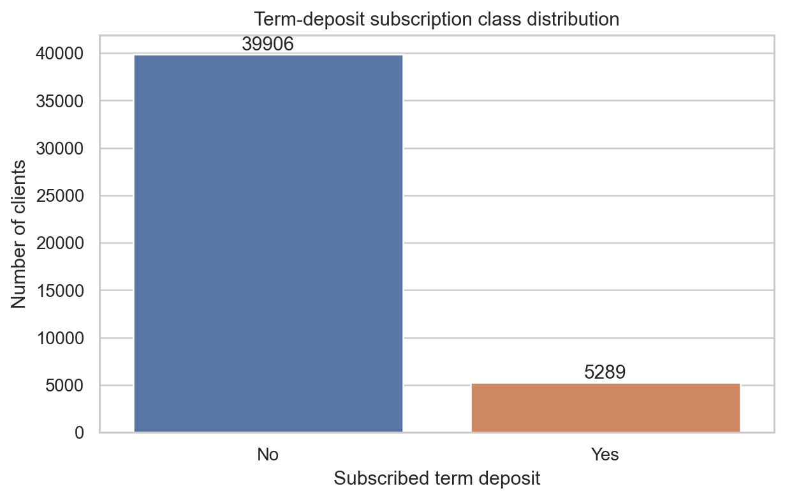
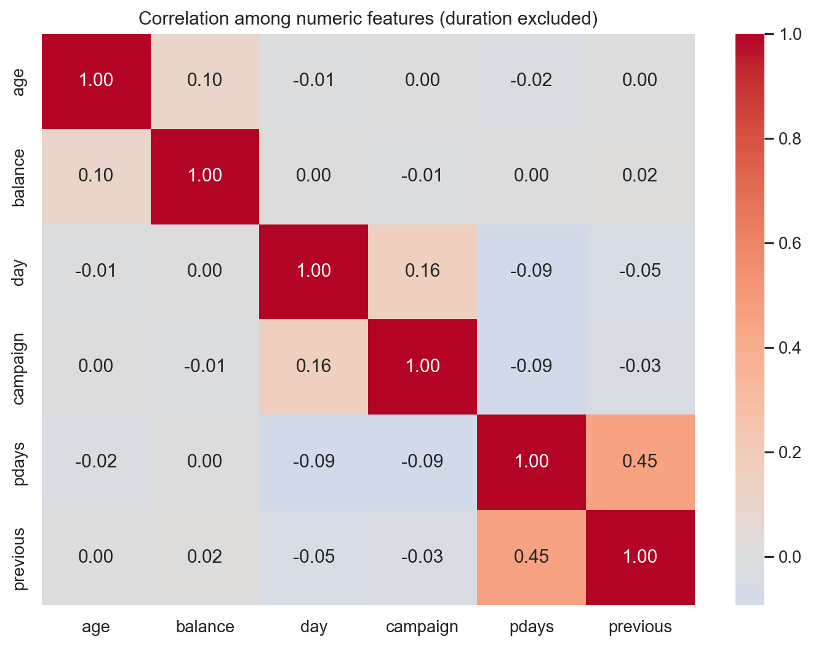
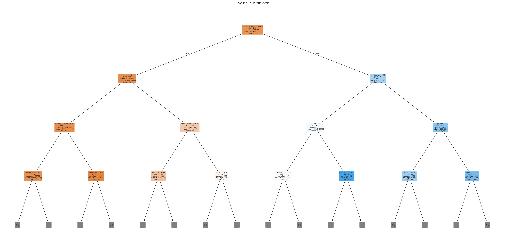
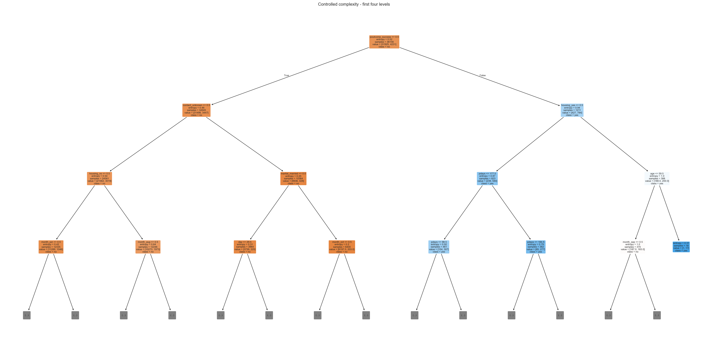
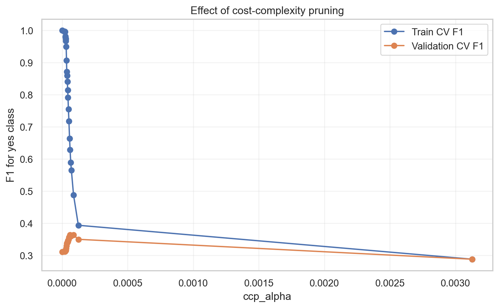
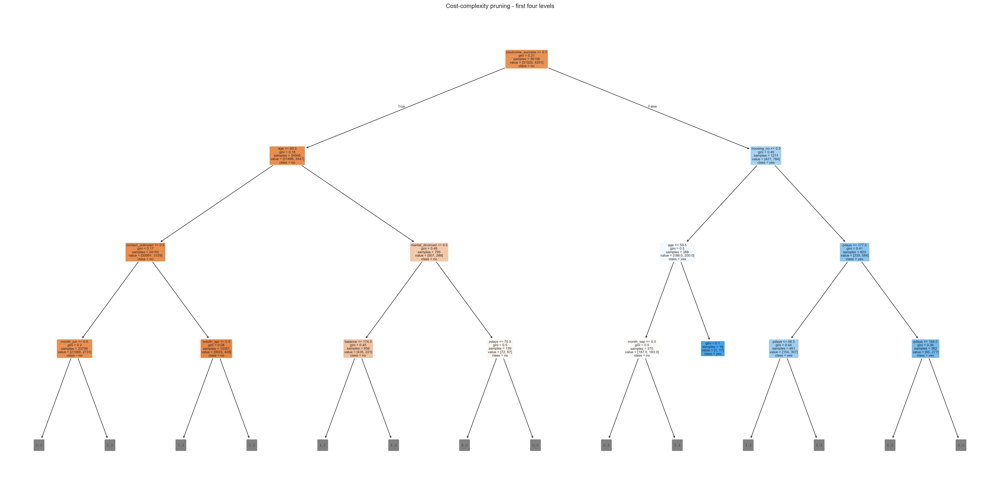
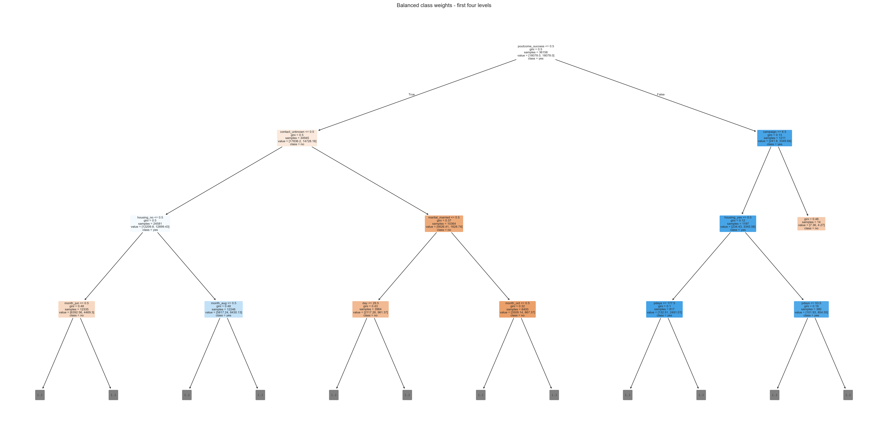
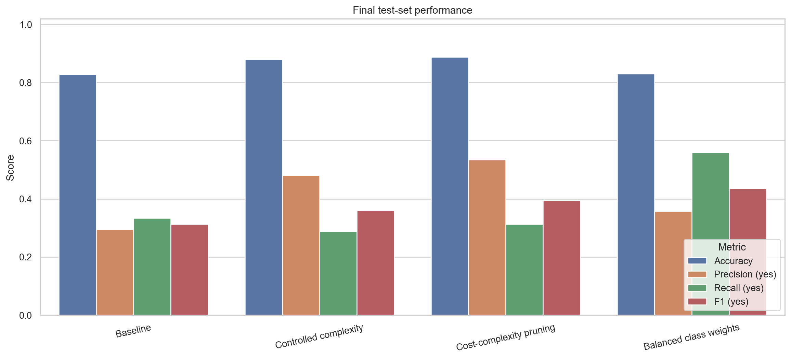
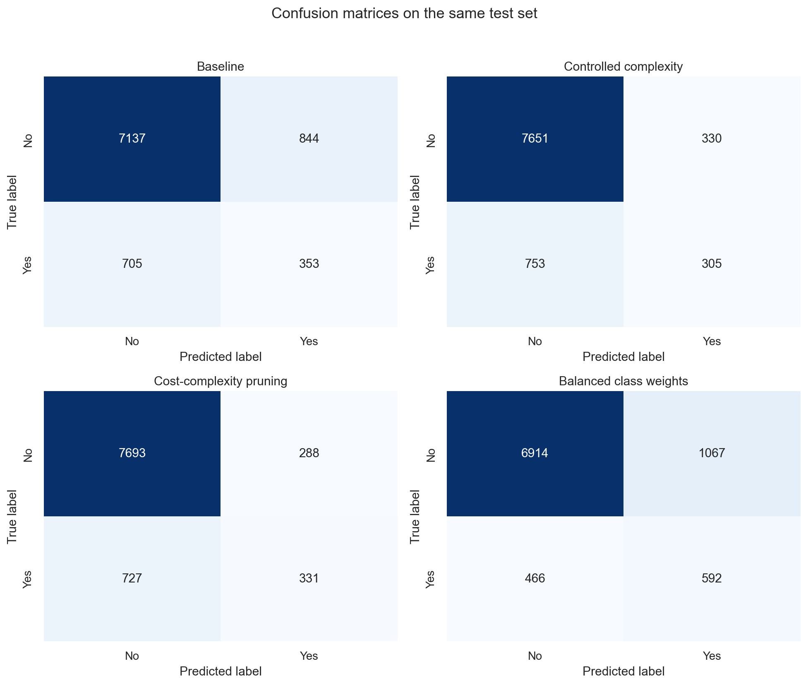
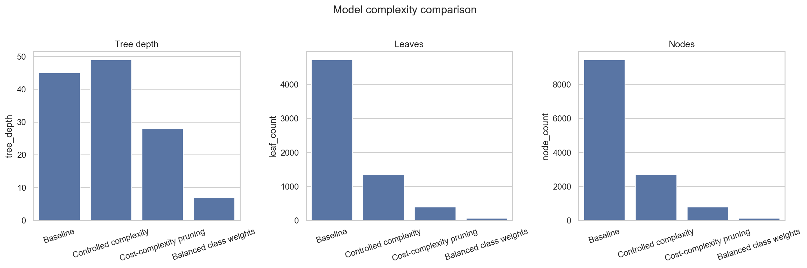

# LAB 2: DECISION TREE MODELING AND IMPROVEMENT

## Bản báo cáo base của Nhóm 05

**Dataset:** Bank Marketing  
**Bài toán:** Binary Classification  
**Target:** `y` - khách hàng có đăng ký tiền gửi kỳ hạn hay không  
**Metric ưu tiên:** F1-score của lớp `yes`  

> Cần điền thông tin thành viên và chỉnh sửa theo đóng góp thật trước khi nộp.

---

## 1. Group Introduction

| STT | Họ và tên | MSSV | Đóng góp |
|---:|---|---|---|
| 1 | `[Thành viên 1]` | `[MSSV]` | Dataset, cấu hình và tích hợp |
| 2 | `[Thành viên 2]` | `[MSSV]` | EDA và tiền xử lý |
| 3 | `[Thành viên 3]` | `[MSSV]` | Baseline và phân tích cây |
| 4 | `[Thành viên 4]` | `[MSSV]` | Controlled complexity và pruning |
| 5 | `[Thành viên 5]` | `[MSSV]` | Class weighting, so sánh và kết luận |

## 2. Introduction

Decision Tree là thuật toán học có giám sát dự đoán bằng chuỗi điều kiện. Internal node chứa một phép kiểm tra feature, branch biểu diễn kết quả điều kiện và leaf chứa class dự đoán. Thuật toán chọn phép chia làm giảm độ hỗn tạp nhiều nhất, thường dùng Gini hoặc Entropy.

Mục tiêu project là dự đoán trước khi liên hệ liệu một khách hàng có đăng ký tiền gửi có kỳ hạn hay không. Project xây dựng baseline, phân tích cây và thử ba phương pháp cải thiện:

1. Kiểm soát độ phức tạp bằng hyperparameters.
2. Cost-complexity pruning.
3. Cân bằng trọng số lớp.

## 3. Dataset Description

### 3.1. Nguồn và target

Bank Marketing được công bố tại UCI Machine Learning Repository. Dữ liệu liên quan đến các chiến dịch tiếp thị trực tiếp bằng điện thoại của một tổ chức ngân hàng tại Bồ Đào Nha.

- Dữ liệu gốc: 45.211 mẫu.
- Feature gốc: 16.
- Target: `y`.
- `no`: không đăng ký.
- `yes`: đăng ký tiền gửi có kỳ hạn.
- Positive class: `yes`.

Sau xử lý, dataset có 45.195 mẫu và 15 feature.

### 3.2. Phân bố lớp

| Class | Số mẫu | Tỷ lệ |
|---|---:|---:|
| `no` | 39.906 | 88,30% |
| `yes` | 5.289 | 11,70% |



Nếu mô hình luôn dự đoán `no`, Accuracy đã xấp xỉ 88,30%. Vì vậy nhóm báo cáo Accuracy theo đề nhưng sử dụng F1 của `yes` làm metric tối ưu chính.

### 3.3. Các feature

Sáu feature numeric:

```text
age, balance, day, campaign, pdays, previous
```

Chín feature categorical:

```text
job, marital, education, default, housing,
loan, contact, month, poutcome
```

### 3.4. Tiền xử lý

- Không có `NaN`.
- Dữ liệu gốc không có dòng trùng hoàn toàn.
- Loại hoàn toàn `duration` vì thời lượng cuộc gọi chỉ biết sau khi cuộc gọi diễn ra. Sử dụng feature này cho dự đoán trước khi liên hệ sẽ gây temporal leakage.
- Sau khi bỏ `duration`, có 16 dòng trùng và các dòng dư được loại bỏ trước khi chia dữ liệu.
- Mã hóa target: `no=0`, `yes=1`.
- Giữ `unknown` như một category riêng.
- One-Hot Encoding categorical features bên trong pipeline để encoder chỉ được fit trong quá trình huấn luyện.
- Không scaling vì Decision Tree không dựa trên khoảng cách.



### 3.5. Train/test split

```text
Train: 36.156 mẫu
  no: 31.925
  yes: 4.231

Test: 9.039 mẫu
  no: 7.981
  yes: 1.058

test_size = 0.20
random_state = 42
stratify = target
```

Mọi mô hình sử dụng cùng test set. Hyperparameters chỉ được chọn bằng 5-fold cross-validation trên train.

## 4. Baseline Model

Baseline sử dụng Decision Tree mặc định với `criterion="gini"`, không giới hạn độ sâu và `random_state=42`.

| Metric | Giá trị |
|---|---:|
| Train Accuracy | 100,00% |
| Test Accuracy | 82,86% |
| Error Rate | 17,14% |
| Precision yes | 29,49% |
| Recall yes | 33,36% |
| F1 yes | 31,31% |
| Balanced Accuracy | 61,39% |
| PR-AUC yes | 17,64% |
| Depth | 45 |
| Leaves | 4.727 |
| Nodes | 9.453 |

Confusion Matrix:

```text
True Negative:  7.137
False Positive:   844
False Negative:   705
True Positive:    353
```



## 5. Analysis of the Baseline Tree

Nút gốc sử dụng:

```text
poutcome_success <= 0.5
```

`poutcome_success` là feature One-Hot cho biết chiến dịch marketing trước có thành công hay không. Điều này cho thấy kết quả của chiến dịch trước tạo ra phép chia ban đầu quan trọng nhất trong tập train.

Một luật mức cao:

```text
Nếu chiến dịch trước thành công,
không có khoản vay mua nhà,
và số lần liên hệ trong chiến dịch hiện tại không quá lớn,
thì cây có xu hướng tăng khả năng dự đoán yes.
```

Luật chỉ phản ánh pattern trong dữ liệu, không chứng minh quan hệ nhân quả.

Baseline đạt 100% Accuracy trên train nhưng chỉ 82,86% trên test. Cây có depth 45 và 4.727 leaf, cho thấy overfitting nghiêm trọng. Test Accuracy của baseline còn thấp hơn chiến lược luôn dự đoán lớp đa số `no`, đồng thời F1 của `yes` chỉ đạt 31,31%.

## 6. Improvement Methods

### 6.1. Controlled Complexity

GridSearchCV thử:

- `criterion`: Gini và Entropy.
- `max_depth`: 3, 5, 7, 10 và không giới hạn.
- `min_samples_split`: 2, 20 và 50.
- `min_samples_leaf`: 1, 10 và 25.

Cấu hình tốt nhất trên train CV:

```text
criterion = entropy
max_depth = None
min_samples_split = 50
min_samples_leaf = 1
Mean CV F1 yes = 35,60%
```

| Metric | Giá trị |
|---|---:|
| Train Accuracy | 91,54% |
| Test Accuracy | 88,02% |
| Error Rate | 11,98% |
| Precision yes | 48,03% |
| Recall yes | 28,83% |
| F1 yes | 36,03% |
| PR-AUC yes | 30,71% |
| Depth | 49 |
| Leaves | 1.344 |

`min_samples_split=50` làm giảm số leaf từ 4.727 xuống 1.344 và giảm khoảng cách train/test. Tuy nhiên, cấu hình được CV chọn không giới hạn độ sâu nên depth không giảm; đây là minh chứng rằng “controlled complexity” không đồng nghĩa mọi chỉ số phức tạp đều giảm.



### 6.2. Cost-complexity Pruning

Pruning sử dụng `ccp_alpha` để cắt nhánh có đóng góp nhỏ. Giá trị tốt nhất trên train CV:

```text
ccp_alpha = 0.00006051
Mean CV F1 yes = 36,38%
```

| Metric | Giá trị |
|---|---:|
| Train Accuracy | 91,91% |
| Test Accuracy | 88,77% |
| Error Rate | 11,23% |
| Precision yes | 53,47% |
| Recall yes | 31,29% |
| F1 yes | 39,48% |
| PR-AUC yes | 36,66% |
| Depth | 28 |
| Leaves | 393 |

Pruning đạt Accuracy và Precision `yes` cao nhất, đồng thời giảm mạnh cây từ 4.727 xuống 393 leaf. Tuy nhiên Recall chỉ đạt 31,29%, nghĩa là bỏ sót 727 trong 1.058 khách hàng `yes` trên test.





### 6.3. Balanced Class Weights

Do tỷ lệ `no:yes` khoảng 7,5:1, phương pháp này dùng `class_weight="balanced"` để tăng ảnh hưởng của lỗi trên lớp `yes`.

Cấu hình tốt nhất:

```text
class_weight = balanced
max_depth = 7
min_samples_split = 50
min_samples_leaf = 10
Mean CV F1 yes = 41,63%
```

| Metric | Giá trị |
|---|---:|
| Train Accuracy | 83,40% |
| Test Accuracy | 83,04% |
| Error Rate | 16,96% |
| Precision yes | 35,68% |
| Recall yes | 55,95% |
| F1 yes | 43,58% |
| Balanced Accuracy | 71,29% |
| PR-AUC yes | 37,28% |
| ROC-AUC yes | 75,98% |
| Depth | 7 |
| Leaves | 66 |

Balanced Class Weights làm Accuracy giảm so với pruning vì dự đoán nhiều khách hàng `yes` hơn. Đổi lại, mô hình tìm đúng 592 khách hàng `yes`, cao hơn baseline 239 trường hợp, và đạt Recall/F1 `yes` cao nhất. Khoảng cách train/test Accuracy chỉ khoảng 0,36 điểm phần trăm, cho thấy khả năng tổng quát hóa ổn định hơn.



## 7. Comparison of Results

| Model | Train Acc. | Test Acc. | Error | Precision yes | Recall yes | F1 yes | Depth | Leaves |
|---|---:|---:|---:|---:|---:|---:|---:|---:|
| Baseline | 100,00% | 82,86% | 17,14% | 29,49% | 33,36% | 31,31% | 45 | 4.727 |
| Controlled complexity | 91,54% | 88,02% | 11,98% | 48,03% | 28,83% | 36,03% | 49 | 1.344 |
| Cost-complexity pruning | 91,91% | **88,77%** | **11,23%** | **53,47%** | 31,29% | 39,48% | 28 | 393 |
| Balanced class weights | 83,40% | 83,04% | 16,96% | 35,68% | **55,95%** | **43,58%** | **7** | **66** |







### 7.1. Mô hình được chọn

Nhóm đã xác định trước F1 của `yes` là metric ưu tiên. Theo tiêu chí này, **Balanced Class Weights** là mô hình tốt nhất trên cả train CV và test:

- CV F1 `yes`: 41,63%.
- Test F1 `yes`: 43,58%.
- Recall `yes`: 55,95%.
- Cây chỉ sâu 7 với 66 leaf.

Nếu mục tiêu kinh doanh thay đổi thành chỉ liên hệ một nhóm nhỏ có xác suất thành công cao, pruning có thể phù hợp hơn vì Precision `yes` đạt 53,47%. Tuy nhiên, với tiêu chí đã thống nhất là cân bằng Precision và Recall, Balanced Class Weights được chọn.

## 8. Conclusion

Project đã xây dựng thành công Decision Tree để dự đoán đăng ký tiền gửi trước khi liên hệ, không sử dụng `duration`. Baseline overfit nghiêm trọng và không xử lý tốt lớp thiểu số. Controlled complexity và pruning cải thiện Accuracy cùng Precision, trong khi Balanced Class Weights cải thiện mạnh Recall và F1 của `yes`.

Bài học chính:

- Cần xác định thời điểm dự đoán để tránh temporal leakage.
- Accuracy có thể gây hiểu nhầm trên dữ liệu mất cân bằng.
- Mô hình tốt nhất phụ thuộc metric ưu tiên.
- Class weighting tạo trade-off giữa False Positive và False Negative.
- Cây đơn giản hơn có thể tổng quát hóa tốt hơn và dễ giải thích hơn.

Hạn chế:

- Kết quả dựa trên một test split cố định.
- `unknown` được xem như category nhưng có thể che giấu nhiều nguyên nhân khác nhau.
- Dữ liệu chiến dịch cũ có thể không phản ánh hành vi hiện tại.
- Mô hình không chứng minh quan hệ nhân quả.

## 9. References

1. Moro, S., Rita, P., & Cortez, P. (2014). Bank Marketing [Dataset]. UCI Machine Learning Repository. <https://doi.org/10.24432/C5K306>
2. UCI Bank Marketing: <https://archive.ics.uci.edu/dataset/222/bank>
3. Scikit-learn Decision Trees: <https://scikit-learn.org/stable/modules/tree.html>
4. Scikit-learn Model Evaluation: <https://scikit-learn.org/stable/modules/model_evaluation.html>

## Appendix - Reproducibility

```powershell
.\run_demo.ps1
```

Kết quả chi tiết nằm trong `outputs/metrics/`; luật cây nằm trong `tree_rules.txt`.

